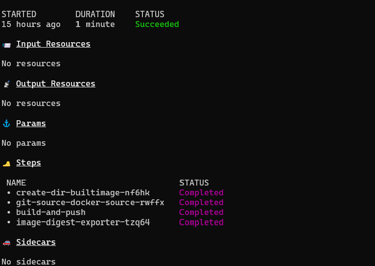
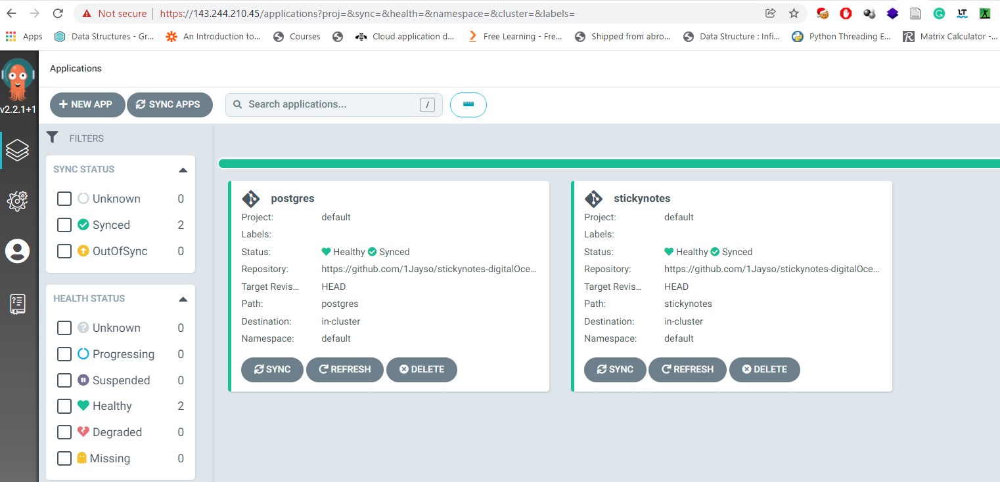

# GitOps CI/CD KubernetesChallenge
# DigitalOcean Kubernetes Challenge 

# Deploy a GitOps CI/CD implementation

>GitOps is an architecture pattern of using Git repositories as the source of truth for defining the desired application state.
>Argo CD is implemented as a kubernetes controller which continuously monitors running applications and compares the current, live state against the desired target state (as specified in the Git repo).

>In this tutorial we will use Tekton and Kaniko as our CI tooling to build the stickynotes application and push to dockerhub.
>ArgoCD will be our Continuous Deployment and Delievery tooling to deploy the application to the 3 node kubernetes cluster on digitalocean


## Requirements

- doctl
- Kubectl
- Tekton and Kaniko
- ArgoCD

## Steps

- To begin with you would have to install all the above tools on your windows, linux or Mac machine.


- Authentication in DigitalOcean

```
doctl auth init [ enter digitalocean token when prompted]
```

- Follow the reference guide below to create a cluster on digitalocean:

   reference: [cluster creation guide](https://docs.digitalocean.com/products/kubernetes/how-to/create-clusters/)

- Follow the reference guide below to connect to a cluster on digitalocean:

   reference: [cluster creation guide](https://docs.digitalocean.com/products/kubernetes/how-to/connect-to-cluster/)

- Follow the reference guide below to install and setup argocd on the cluster:

   reference: [cluster creation guide](https://argo-cd.readthedocs.io/en/stable/getting_started/)

- Argocd 


- Apply the manifest files to build and push the image to docker hub

```
1. kubectl apply -f secrets.yaml
2. kubectl apply -f dockerhub-service.yaml
3. kubectl apply -f stickynotes-code.yaml
4. kubectl apply -f registry.yaml
5. kubectl apply -f task.yaml
6. kubectl apply -f taskRuner.yaml
```

- After sometime run the command below to verify if the image has succesfully been pushed to been built and pushed

```
tkn taskrun describe build-docker-image-from-git-source-task-run
```


- Deploy the postgres argocd applications to the kubernetes cluster by running the commands below:

```
kubectl apply -f postgres-argocd.yaml
```
- When postgres is succesfully deployed, run the command below and copy one of the endpoint IPs and paste in the deployment file of the stickynotes app. Paste that as the value of POSTGRES_HOST:

```
kubectl describe  svc -n test postgres-service
```

- Now run the command below to deploy the sticknotes app to the cluster

```
kubectl apply -f stickynotes-argocd.yaml
```



- Last but not the least, go to your terminal and run the command below:
```
kubectl get svc -n sandbox
```
- Copy and paste the loadbalancer IP (external IP) and port number of the application in the browser as shown below:

  Application URL: [http://143.244.209.141:8000/](http://143.244.209.141:8000/)

- click on this link to view the deployed application in your browser 
   http://143.244.209.141:8000/

- Done!